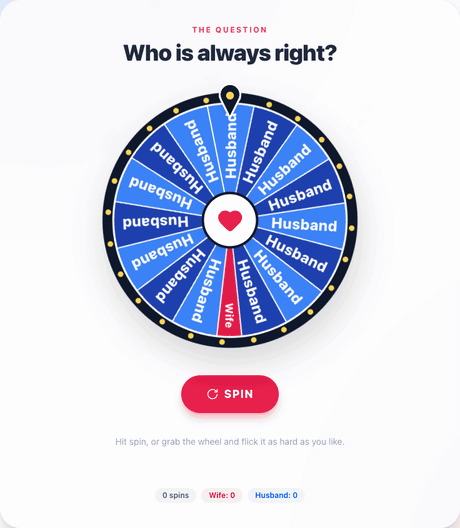
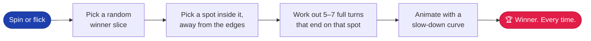

<div align="center">

<a href="https://rehmanalimomin.github.io/rigged-wheel/">
  
</a>

# The Totally Fair Wheel

**Settle any argument with certified randomness.\***

<sub>\*It always lands on the tiny slice. Always.</sub>

<br />

[](https://rehmanalimomin.github.io/rigged-wheel/)
&nbsp;
[](https://github.com/RehmanaliMomin/rigged-wheel/actions/workflows/deploy.yml)
&nbsp;
[](LICENSE)

</div>

---

## 🎯 Pick an argument, then spin

Every link opens the wheel already set up. Send one to the person you're arguing with.

| The question | Always lands on | Against |
| :-- | :-: | :-: |
| [**Who picks dinner?**](https://rehmanalimomin.github.io/rigged-wheel/?q=Who+picks+dinner%3F&w=Wife&l=Husband&nl=15&nw=1) | 🟥 Wife | 15 × Husband |
| [**Who was right about the directions?**](https://rehmanalimomin.github.io/rigged-wheel/?q=Who+was+right+about+the+directions%3F&w=Wife&l=Husband&nl=19&nw=1) | 🟥 Wife | 19 × Husband |
| [**Who gets the TV remote?**](https://rehmanalimomin.github.io/rigged-wheel/?q=Who+gets+the+TV+remote%3F&w=Mom&l=Kids&nl=11&nw=1) | 🟥 Mom | 11 × Kids |
| [**Who really owns this house?**](https://rehmanalimomin.github.io/rigged-wheel/?q=Who+really+owns+this+house%3F&w=Cat&l=Humans&nl=15&nw=1) | 🟥 Cat | 15 × Humans |
| [**Who is doing the dishes tonight?**](https://rehmanalimomin.github.io/rigged-wheel/?q=Who+is+doing+the+dishes+tonight%3F&w=Husband&l=Wife&nl=19&nw=1) | 🟥 Husband | 19 × Wife |
| [**Who is the better driver?**](https://rehmanalimomin.github.io/rigged-wheel/?q=Who+is+the+better+driver%3F&w=Wife&l=Husband&nl=36&nw=4) | 🟥 Wife ×4 | 36 × Husband |

Or [build your own](https://rehmanalimomin.github.io/rigged-wheel/): change the question, both names and the slice counts, then hit **Share**.

## 🎬 What it looks like

<div align="center">
  
  <br />
  <sub>A real spin, recorded in headless Chrome. Not staged. Didn't need to be.</sub>
</div>

<br />

<picture>
  <source media="(prefers-color-scheme: dark)" srcset="docs/screenshot-dark.png" />
  <source media="(prefers-color-scheme: light)" srcset="docs/screenshot-light.png" />
  
</picture>
<p align="center"><sub>This screenshot follows your GitHub theme. Switch between light and dark to see both.</sub></p>

## ✨ Features

- 🎡 **A rigged wheel that looks fair.** It picks where to stop first, then spins 5–7 full turns to get there, slowing down over 4–5 seconds.
- 👆 **Grab it and flick it.** Flick it either way, as hard as you want. A harder flick just means a longer spin. It still lands on the same slice.
- 🔊 **Sound, made live in the browser.** You hear a tick for every slice that passes, and the pointer bounces. There's a short tune when it stops. No audio files.
- 🎉 **Confetti** from [`canvas-confetti`](https://github.com/catdad/canvas-confetti), switched off for people who turn on reduced motion.
- 🎛️ **Set it up your way.** Change the question and both names, and set how many slices each side gets (up to 40 in total). The winner's slice can be made tiny, which is funnier.
- 🔗 **Share links** carry all your settings. On phones, the Share button opens the phone's own share menu.
- 🌗 **Light and dark mode.** It starts out matching your device and remembers your choice.
- 📊 **A running score** that keeps count of every spin.

## 🧮 How the rig works



<details>
<summary><b>Show me the math</b></summary>

<br />

The pointer is fixed at 12 o'clock. If the wheel has turned `r` degrees clockwise, the part of the wheel under the pointer is at `−r` (mod 360).

So to stop on a spot `θ` inside the winner's slice, the wheel has to end at a rotation that's the same as `−θ` (mod 360):

```js
const target = win.start + (win.end - win.start) * (0.15 + Math.random() * 0.7);
const offset = direction > 0 ? mod(-target - from, 360) : mod(from + target, 360);
const to     = from + direction * (turns * 360 + offset);   // turns = 5..7
```

Each frame of the animation moves along `from → to` using `1 − (1 − t)⁴`. That curve starts fast and has a long, slow crawl at the end, so the last few ticks feel close. How hard you flick only changes `turns` and the duration. **`to` always stops on the winner.**

A test script tried 31,200 random spins covering every Husband/Wife mix up to 40 slices: **0 misses.**

</details>

## 🔗 Share-link settings

| Param | What it sets | Default |
| :-- | :-- | :-- |
| `q` | The question | `Who is always right?` |
| `w` / `l` | Winner / loser name | `Wife` / `Husband` |
| `nw` / `nl` | Number of winner / loser slices (up to 40 in total) | `1` / `15` |
| `tiny` | `0` makes the winner's slices normal width | tiny |

## 🛠️ Run it locally

```bash
git clone https://github.com/RehmanaliMomin/rigged-wheel.git
cd rigged-wheel
npm install
npm run dev
```

Every push to `main` builds the site and publishes it to GitHub Pages ([workflow](.github/workflows/deploy.yml)).

### Use it in your own project

The whole app is one file, [`src/RiggedWheel.jsx`](src/RiggedWheel.jsx). You can copy it into any React project that uses Tailwind CSS (v3 or v4):

```bash
npm i lucide-react canvas-confetti
```

```jsx
import RiggedWheel from './RiggedWheel.jsx';

export default function App() {
  return <RiggedWheel />;
}
```

## 🧰 Built with

React · Tailwind CSS · Vite · Lucide icons · canvas-confetti · the Web Audio API · an SVG wheel · questionable ethics

## 📄 License

[MIT](LICENSE). Rig your own arguments freely.
