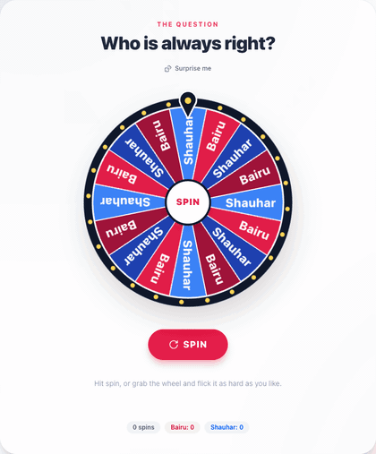
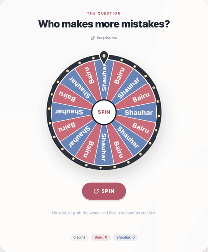
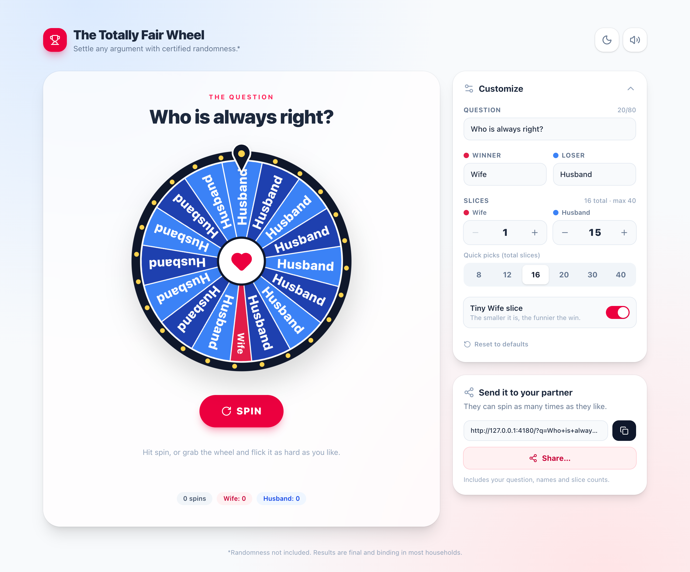
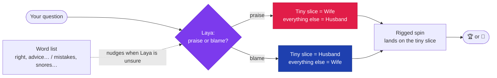

<div align="center">

<a href="https://rehmanalimomin.github.io/rigged-wheel/">
  
</a>

# The Totally Fair Wheel

**Settle any argument with certified randomness.\***

<sub>\*Praise always goes to Wife. Blame always goes to Husband. An AI reads the question to decide which.</sub>

<br />

[](https://rehmanalimomin.github.io/rigged-wheel/)
&nbsp;
[](https://github.com/RehmanaliMomin/rigged-wheel/actions/workflows/deploy.yml)
&nbsp;
[](https://huggingface.co/convaiinnovations/laya)
&nbsp;
[](LICENSE)

</div>

---

## 🎯 Type any question, and the wheel knows who it's about

Ask something nice and the wheel lands on **Wife**. Ask something embarrassing and it lands on **Husband**. The wheel fills up with the other name, the right answer gets one tiny slice, and it still lands on that slice every time.

| 💐 Praise, so it's Wife | 🙃 Blame, so it's Husband |
| :-- | :-- |
| [Who is always right?](https://rehmanalimomin.github.io/rigged-wheel/?q=Who+is+always+right%3F) | [Who makes more mistakes?](https://rehmanalimomin.github.io/rigged-wheel/?q=Who+makes+more+mistakes%3F) |
| [Whose advice should we follow?](https://rehmanalimomin.github.io/rigged-wheel/?q=Whose+advice+should+we+follow%3F) | [Who snores louder?](https://rehmanalimomin.github.io/rigged-wheel/?q=Who+snores+louder%3F) |
| [Who has better taste?](https://rehmanalimomin.github.io/rigged-wheel/?q=Who+has+better+taste%3F) | [Who ate the last slice?](https://rehmanalimomin.github.io/rigged-wheel/?q=Who+ate+the+last+slice%3F) |

Or [write your own](https://rehmanalimomin.github.io/rigged-wheel/). There are 24 more ideas in the app, plus a 🎲 **Surprise me** button.

## 🎬 What it looks like

<table>
  <tr>
    <td align="center" width="50%">
      
      <br /><sub><b>Praise:</b> 15 × Husband, 1 tiny Wife. Lands on Wife. Fanfare and confetti.</sub>
    </td>
    <td align="center" width="50%">
      
      <br /><sub><b>Blame:</b> 15 × Wife, 1 tiny Husband. Lands on Husband. Sad trombone and 🤦.</sub>
    </td>
  </tr>
</table>

<picture>
  <source media="(prefers-color-scheme: dark)" srcset="docs/screenshot-dark.png" />
  <source media="(prefers-color-scheme: light)" srcset="docs/screenshot-light.png" />
  
</picture>
<p align="center"><sub>This screenshot follows your GitHub theme. Switch between light and dark to see both.</sub></p>

## ✨ Features

- 🧠 **Laya reads the question.** [Laya](https://huggingface.co/convaiinnovations/laya) is a small AI model that sorts text into categories. It decides whether being the answer is praise or blame, and the wheel shows its call and how sure it is: *"Laya: sounds like blame · 85% sure → Husband"*.
- ↔️ **Flip** sends a question to the other person when you disagree with Laya. You can also pick a person yourself under **Who does it land on?**
- 💡 **24 question ideas**, half praise and half blame, plus 🎲 **Surprise me**.
- 🎡 **Rigged, but it looks fair.** It picks where to stop first, then spins 5–7 full turns to get there, slowing down over 4–5 seconds.
- 👆 **Grab it and flick it.** Flick it either way, as hard as you want. A harder flick means a longer spin, but it lands on the same slice.
- 🔊 **Sound, made live in the browser.** A tick for every slice that passes, a fanfare for praise and a sad trombone for blame. No audio files.
- 🎉 **Confetti** for praise, and 🤦🙃😬 raining down for blame. Both are switched off for people who turn on reduced motion.
- 🎛️ **Set it up your way.** Change both names and the number of landing and decoy slices (up to 40 in total). The landing slices can be made tiny.
- 🔗 **Share links** carry every setting. On phones, **Share** opens the phone's own share menu.
- 🌗 **Light and dark mode.** It starts out matching your device and remembers your choice.

## 🧠 How it decides



- **Laya** gets the question with one instruction: *"Is being picked as the answer a good thing or a bad thing for that person?"* It sends back how likely the answer is praise. It runs on a CPU and answers in about 30 ms.
- **A built-in word list** (praise words like *right*, *advice*, *better*; blame words like *mistakes*, *snores*, *late*; "never" flips a word) adds a nudge to Laya's answer. That only changes the result when Laya is unsure.
- **"Who should…" questions are taunts.** When the person picked is the one who *should / needs to / has to* do something ("Who should respect the other more?", "Who needs to listen more?"), the word list overrules Laya and it goes to Husband. Laya alone gets these wrong, because it reads "respect" as a nice word. The exceptions are perks ("Who should *pick* the movie?") and questions where someone else is the subject ("Who should *we* listen to?"), and those stay praise.
- **Without Laya** (the server is off or slow), the word list decides alone. If it finds no clues, the question counts as praise.

<details>
<summary><b>How accurate is it?</b></summary>

<br />

We tested 67 labelled questions: the ones in the app, plus others, plus 21 "who should / needs to" questions. Seven ways of wording the instruction to Laya were compared first.

| | Correct |
| :-- | :-: |
| Laya alone | 54 / 67 |
| Word list alone | 64 / 67 |
| **Both together** | **66 / 67** |

The one it still misses is "Who keeps the house together?". The word list was written with these questions in view, so expect it to do a bit worse on questions nobody has tried yet. That's what **Flip** is for.

</details>

<details>
<summary><b>How the rig works (the math)</b></summary>

<br />

The pointer is fixed at 12 o'clock. If the wheel has turned `r` degrees clockwise, the part of the wheel under the pointer is at `−r` (mod 360). To stop on a spot `θ` inside a landing slice, the wheel has to end at a rotation that's the same as `−θ` (mod 360):

```js
const angle  = target.start + (target.end - target.start) * (0.15 + Math.random() * 0.7);
const offset = direction > 0 ? mod(-angle - from, 360) : mod(from + angle, 360);
const to     = from + direction * (turns * 360 + offset);   // turns = 5..7
```

Each frame moves along `from → to` using `1 − (1 − t)⁴`. That curve starts fast and has a long, slow crawl at the end, so the last few ticks feel close. A test script tried 31,200 random spins covering every slice mix up to 40: **0 misses.**

</details>

## 🔗 Share-link settings

| Param | What it sets | Default |
| :-- | :-- | :-- |
| `q` | The question | `Who is always right?` |
| `w` / `l` | Who gets the credit / who gets the blame | `Wife` / `Husband` |
| `nw` / `nl` | Number of landing / decoy slices (up to 40 in total) | `1` / `15` |
| `tiny` | `0` makes the landing slices normal width | tiny |
| `v` | `credit` or `blame` fixes the result instead of asking Laya | Laya decides |

## 🖥️ Hosting Laya

The website is static and lives on GitHub Pages. Laya is a Python model (421M parameters), so it runs separately as a small API ([`server/`](server/)): one `POST /classify` endpoint, built with FastAPI.

**On your own Mac, through ngrok:**

```bash
NGROK_DOMAIN=your-name.ngrok-free.app ./server/host-on-mac.sh
```

The first run installs Laya and downloads the model (about 1.7 GB). After that, it starts Laya and opens the tunnel, and keeps the Mac awake while the terminal stays open. Then give the site Laya's address. It's read when the site is built:

```bash
gh variable set LAYA_URL --body https://your-name.ngrok-free.app
gh workflow run deploy.yml
```

When the Mac is off, the site keeps working and uses the word list.

**On a server:** [`server/Dockerfile`](server/Dockerfile) builds an image with the model already inside it. It runs anywhere that has about 3 GB of RAM (Hugging Face Spaces on PRO, Cloud Run, Fly and so on).

## 🛠️ Run it locally

```bash
git clone https://github.com/RehmanaliMomin/rigged-wheel.git
cd rigged-wheel
npm install
npm run dev                                          # word list only
VITE_LAYA_URL=http://127.0.0.1:7860 npm run dev      # with Laya running locally
```

Every push to `main` builds the site and publishes it to GitHub Pages ([workflow](.github/workflows/deploy.yml)).

### Use it in your own project

The whole app is one file, [`src/RiggedWheel.jsx`](src/RiggedWheel.jsx). You can copy it into any React project that uses Tailwind CSS (v3 or v4):

```bash
npm i lucide-react canvas-confetti
```

```jsx
import RiggedWheel from './RiggedWheel.jsx';

export default function App() {
  return <RiggedWheel />;
}
```

## 🧰 Built with

React · Tailwind CSS · Vite · [Laya](https://huggingface.co/convaiinnovations/laya) · FastAPI · Lucide icons · canvas-confetti · the Web Audio API · an SVG wheel · questionable ethics

## 📄 License

[MIT](LICENSE). Rig your own arguments freely. Laya itself is Apache-2.0.
